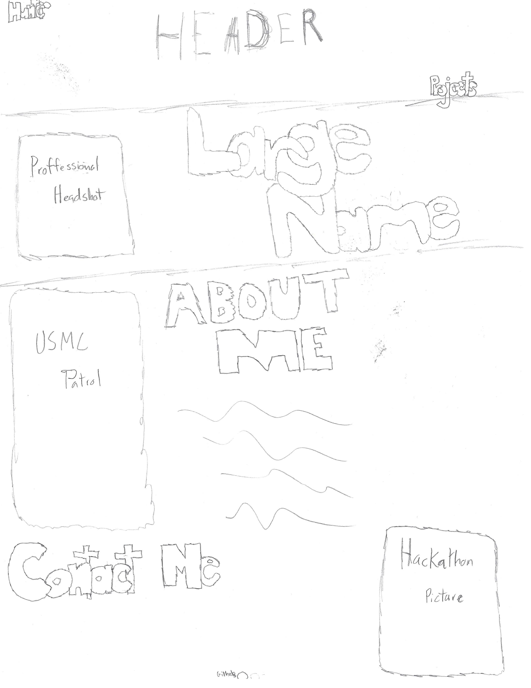

# Portfolio Site V3

## Frontend
The frontend will consist of `HTML`, `HTMX`, and `SCSS`.  `Javascript` will be used as a last resort and if needed,  it will be `Typescript`.  The development platform will be `Firefox`, my IDE will be `emacs`, and the template engine will be a `Jinja2` clone called `Askama`.

## Backend
The backend will be written in `Rust`.  The `Actix-web` is the web server.  This is the first web application I will be making from a repostitory template.  The template gives options to use any of four database singularly or in tandem. The databases are `Redis`, `Sqlite`, `Mongodb`, and `Postgresq1el`.

## Design

The following sketch will be the template for the design of this third iteration of my portfolio site:

